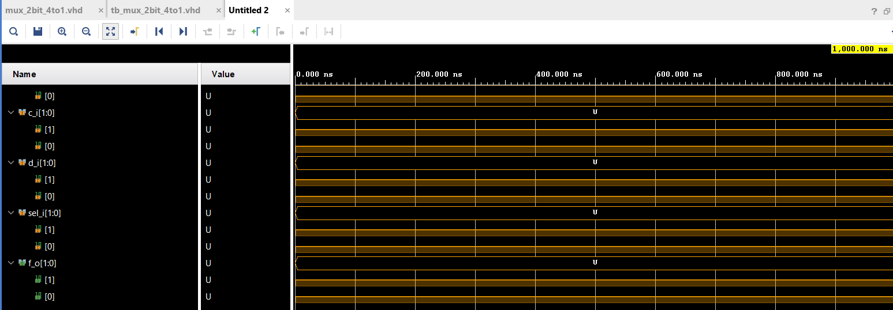

# Lab - 03-vivado
## Multiplexer


### 1. Table with connection of 16 slide switches and 16 LEDs on nexys a7 board 


| **Component** | **Pin** |
| :-: | :-: |
| SW0 | J15 |
| SW1 | L16 |
| SW2 | M13 |
| SW3 | R15 |  
| SW4 | R17 |
| SW5 | T18 |
| SW6 | U18 |
| SW7 | R13 |
| SW8 | T8 | 
| SW9 | U8 |
| SW10 | R16 | 
| SW11 | T13 | 
| SW12 | H6 |
| SW13 | U12 | 
| SW14 | U11 | 
| SW15 | V10 | 


### LED

| **Component** | **Pin** |
| :-: | :-: |
| LED0 | H17 |
| LED1 | K15 |
| LED2 | J13 |
| LED3 | N14 |
| LED4 | R18 |
| LED5 | V17 |
| LED6 | U17 |
| LED7 | U16 |
| LED8 | V16 |
| LED9 | T15 |
| LED10 | U14 |
| LED11 | T16 |
| LED12 | V15 |
| LED13 | V14 |
| LED14 | V12 |
| LED15 | V11 |


#### Project creation
Open
File -> New Project or Under the Quick Start click "Create Project"
Click "Next >"
Type name of the project and select project location where it should be placed, then click "Next>"
Click "Next >"
##### Adding source file
Click "Create File", make sure that u are setting file type under "VHDL" and type file name, it should same as project name
Click OK then Next 3times
Click on "Boards" and select your board -  lab3 board : "Nexys A7-50T"
Click "Next >"
Click "Finish"
Click "OK" and "Yes"
###### Adding testbench file
File-Add sources 
Click "Next >"
Click "Create File", make sure your file type is under "VHDL" and type file name which is important to start with "tb_" and then our project name
Click "OK"
Click "Finish"
Click "OK" and "Yes"

####### Code of testbench 
```vhdl
p_stimulus : process
    begin
        -- Report a note at the begining of stimulus process
        report "Stimulus process started" severity note;


        -- First test values
        s_d <= "00"; s_c <= "00"; s_b <= "00"; s_a <= "00";
        s_sel <= "00"; wait for 50 ns;
        
        s_a <= "01"; wait for 50 ns;
        s_b <= "01"; wait for 50 ns;
        
        s_sel <= "01"; wait for 50 ns;
        s_c <= "00"; wait for 50 ns;
        s_b <= "11"; wait for 50 ns;
        
        s_d <= "10"; s_c <= "11"; s_b <= "01"; s_a <= "00"; 
        s_sel <= "10"; wait for 50 ns;
        
        s_d <= "00"; s_c <= "00"; s_b <= "00"; s_a <= "00"; 
        s_sel <= "10"; wait for 50 ns;
        
        s_d <= "10"; s_c <= "11"; s_b <= "01"; s_a <= "00";
        s_sel <= "11"; wait for 50 ns;

        -- Report a note at the end of stimulus process
        report "Stimulus process finished" severity note;
        --wait;
    end process p_stimulus;
 ```
 
 ####### Code of design
 ```vhdl
 begin
    -- Connecting testbench signals with comparator_2bit entity (Unit Under Test)
    uut_mux_2bit_4to1 : entity work.mux_2bit_4to1
        port map(
            a_i           => s_a,
            b_i           => s_b,
            c_i           => s_c,
            d_i           => s_d,
            sel_i         => s_sel,
            f_o => s_f
        );

  ```



